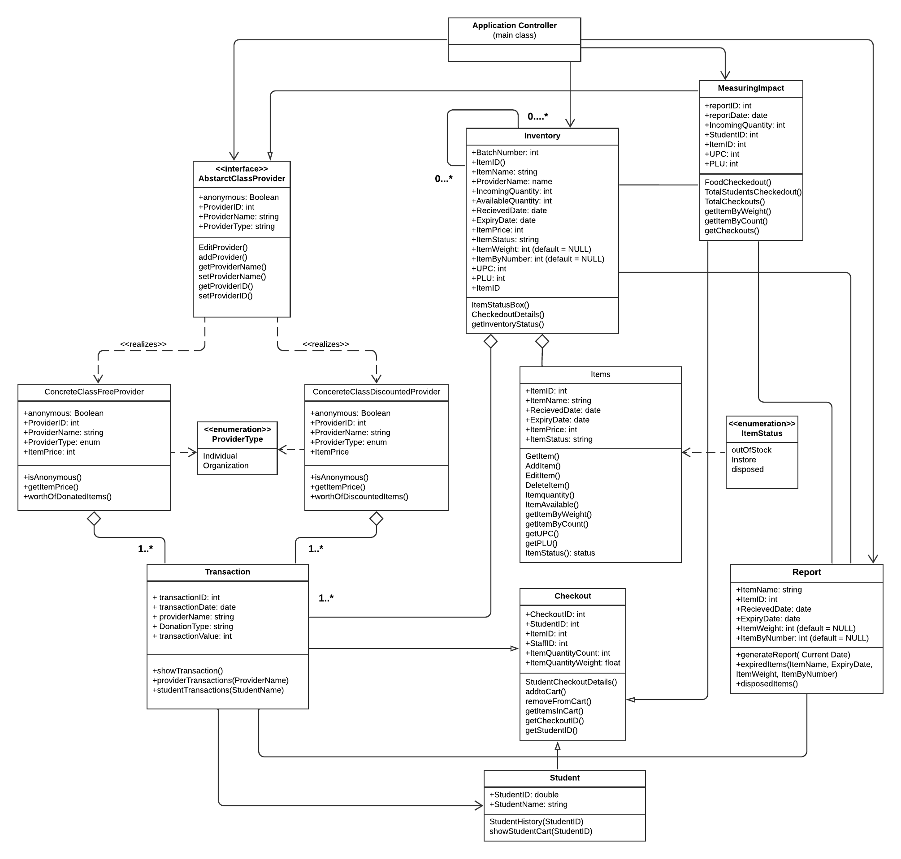

# Contributing to PantryRails Project

Thank you for your interest in PantryRails Project. Our goal is to develop a food pantry for students in a university, who can have access to enough food to eat. We want to create a system to manage the inventory of a food pantry, as well as generate reports about the pantry's activities. The web application is intended to keep track of every activity in the Pantry. The application keeps track of all major activities like a complete report for each provider that makes donations, builds their donation history and adds into the report all the donations made. We are trying to design a website that manages the information.

PantryRail welcomes contributions from everyone.

Contributions to PantryRails should be made in the form of GitHub pull requests. Each pull request will be reviewed by a core contributor (someone with permission) and either landed in the main tree or given feedback for changes that would be required.

# Installation & Getting started with the project development

This project was developed in Runy & Rails under the mac OS environment. Please find the below steps to install Ruby and Rails.

## Prerequisites

* Ruby 2.6.5 (or higher)
* Ruby Gems
  * rake
  * bundler
  * A Rails-compatible SQL database
  * PostgreSQL (recommended)
  * MySql (works ok, too)

#### Install home-brew
$ /bin/bash -c "$(curl -fsSL https://raw.githubusercontent.com/Homebrew/install/master/install.sh)"

#### Package manager brew and rbenv
$ brew update

#### Install ruby build
$ brew install rbenv

#### Add the below line to bash_profile
$ eval "$(rbenv init -)"

#### Execute the command in the terminal
$ source .bash_profile

#### Install rbenv
$ rbenv install 2.6.5

#### Run the below command and every time we install new version of ruby
$ rbenv rehash
$ rbenv versions

#### Check the version
$ ruby -v

#### To switch to another version of ruby
$ rbenv global 2.6.5

#### To use the version inside that project
$ rbenv local system
$ rbenv local 2.6.5

#### Installing the gems package manager
$ gem -v
$ gem list

#### Installing Ruby on Rails
$ gem install rails

####  Install mysql on MacOS
$ brew update
$ brew install mysql

####  To set root password
$ mysql_secure_installation
$ brew services start mysql
$ mysql -u root -p

#### Install ruby gems for mysql
$ gem install mysql2
$ gem install mysql2 -- --with-opt-dir="$(brew --prefix openssl)"

#### Installing javascript tools for ruby and rails
$ brew install node
$ brew install yarn

Once the above installation is successful, clone the PantryRails repository and start the server with the command $ rails server. Navigate to the browser and type http://127.0.0.1:3000. The PantryRails project should be successsfully running in the browser.

## UML Diagram
1. *UML diagram before implementation of class ApplianceInventory:*

2. *UML diagram after implementation of class ApplianceInventory:*

## UML Description

In our UML diagram, we have implemented the Abstract Factory Design Pattern. The requirement specifies two types of Donators, the ones that donate food for free and the ones that provide a discount on the food products that the pantry purchases.
As the providers of both types will have some functionality in common, we have made the Provider class an Abstract Provider class and two concrete classes, ConcreteClassFree and ConcreteClassDiscount. This creates an efficient design as we can use the two classes separately whenever required without any tight coupling.

# The Abstract Class Provider performs the following functionality:
Enables addition of  a provider, editing provider details, get and set ProviderName and ProviderID.

# The Concrete classes perform the following functionality:
The function is anonymous returns a bool type that specifies if the providers wish to remain anonymous or not.
The function getItemPrice, returns the price of each Item and the functions worthOfDonatedItems and worthOfDiscountedItems calculate and return the worth of respective items.

The Checkout class manages all the **Checkout functionality** like, adding Items to student’s cart, removing them and return all items present in cart.

The Report class performs all activities related to generating a waste reduction report. It performs the activity of returning the Items Expiring on the present day, Expired items and also lets the admins update what they have disposed and in what quantity, via the disposedItems() functions.

The Items class records the details of each and every item in the Inventory. It also returns available items and their quantity. The function ItemStatus returns either of the three enum types, outOfStock, Instore and Disposed depending on what the current status of each item.

The Student class has a function StudentHistory that returns a history of all transactions made by the student and another function that has a track of the students cart.

The class MeasuringImpact has a ton of important functionality, it checks the total available quantity of each and every Item in the inventory, it also tracks the total checkouts made, total students checked out and total checkouts by each student. It also helps keep track of each item as to how much quantity of each Item has been used well and if any amount of food has been wasted.

## Pull Request Process

1. Branch from the travis branch and, if needed, rebase to the current master branch before submitting your pull request. If it doesn't merge cleanly with master you may be asked to rebase your changes.
2. Update the [README.md](README.md) with details of changes to the interface, this includes new environment variables and all other useful file locations and parameters.
3. Commits should be as small as possible, while ensuring that each commit is correct independently (i.e., each commit should compile and pass tests).
4. You may merge the Pull Request in once you have the sign-off of two other developers, or if you do not have permission to do that, you may request the second reviewer to merge it for you.
5. Don't put submodule updates in your pull request unless they are to landed commits.

## Our Responsibilities

Project maintainers are responsible for clarifying the standards of acceptable behavior and are expected to take appropriate and fair corrective action in response to any instances of unacceptable behavior.

Project maintainers have the right and responsibility to remove, edit, or reject comments, commits, code, wiki edits, issues, and other contributions that are not aligned to this Code of Conduct, or to ban temporarily or permanently any contributor for other behaviors that they deem inappropriate, threatening, offensive, or harmful.

## License Information

Licensing information can be found [here](https://github.com/ChicoState/PantryRails/blob/travis/LICENSE)
