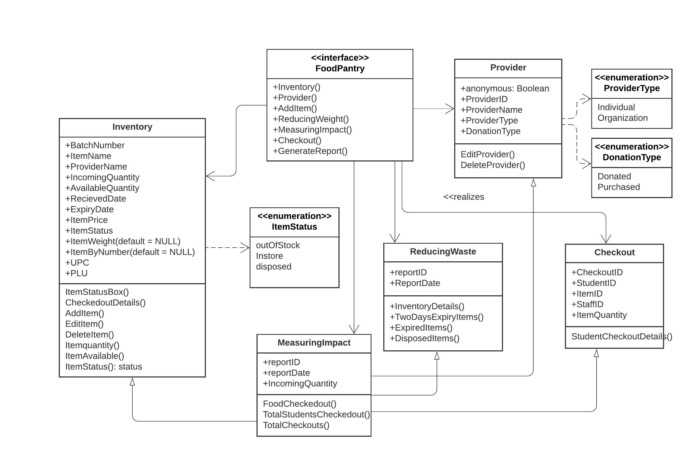

## Food Pantry

Our goal is to develop a food pantry for students in a university, who can have access to enough food to eat. We want to create a system to manage the inventory of a food pantry, as well as generate reports about the pantry's activities. We are trying to design a website that manages the information. The system keeps track of all the information and students will check out items by visiting the food pantry in person, selecting items, and then checking out with a food pantry staff member. 

## Getting Started
These instructions will get you a copy of the project up and running on your local machine for development and testing purposes. See deployment for notes on how to deploy the project on a live system.

## Technologies
Project is created with 
* Ruby on Rails
* MySql

## Prerequisites / Installation / Deployment
The installation part and gettign started with the project development is detailed in the [contributing](CONTRIBUTING.md) section. 

## Contributing
Please read [contributing](CONTRIBUTING.md) for details on our code of conduct, and the process for submitting pull requests to the project.

## CI / CD Pipeline
We use Travis CI for our project. It runs our programs tests every time we commit to GitHub. We are able to discover very quickly if our commit is broken, and fix it before it becomes a problem. More details on Travis can be found [here](https://docs.travis-ci.com/).

## Static Analysis Tool
We use [Rubocop](https://github.com/rubocop-hq/rubocop) as static code alalyser for the project PantryRails. The official docs for RuboCop can be found [here](https://docs.rubocop.org/en/stable/)

By using RuboCop, we will not only get to perform a code review as Ruby, but also learn about Rails’ specific improvement points. 

## Continuous Integration Status

## Project Contributing Members
Padam Rana, Zaiba Fathima, Piradeepan Nagarajan

## Copyright
This project is licensed under the GNU GENERAL PUBLIC LICENSE - see the [LICENSE](LICENSE) for further details.

## Acknowledgments & Inspiration
Our instructor [Kevin Buffardi, Ph.D.](https://www.csuchico.edu/csci/people/faculty/buffardi-kevin.shtml)
* [LinkedIn](https://www.linkedin.com/in/kevin-buffardi-5a84351/)
* [Github](https://github.com/kbuffardi)
* [Twitter](https://twitter.com/drkevinbuffardi?lang=en)
* [Google Scholar](https://scholar.google.com/citations?user=KmIt5HIAAAAJ&hl=en)

## UML Diagram
